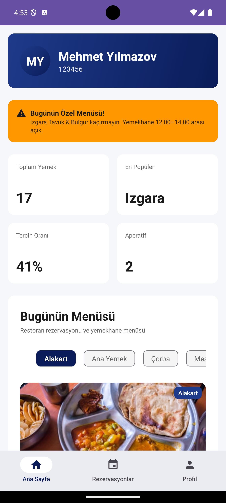
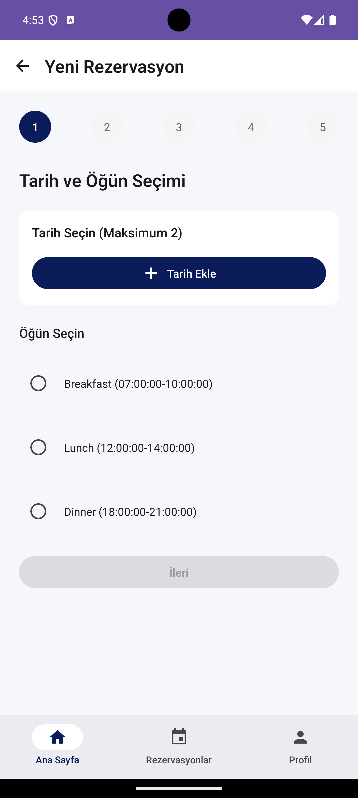
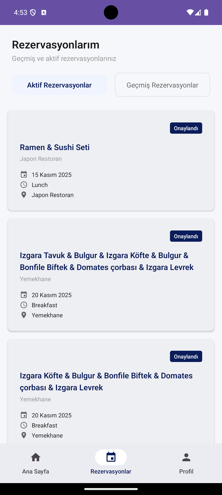
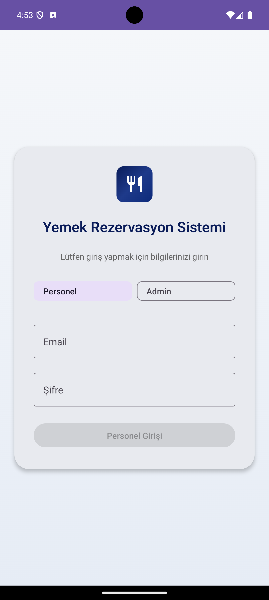
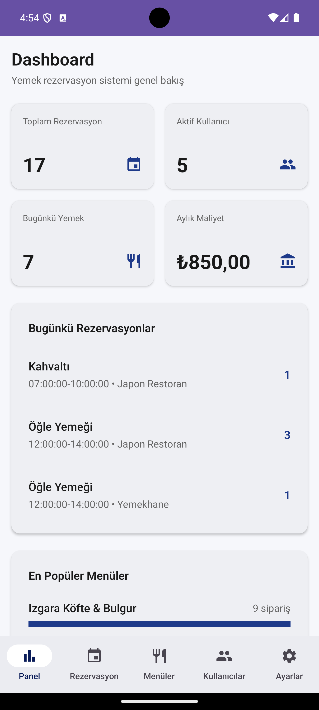
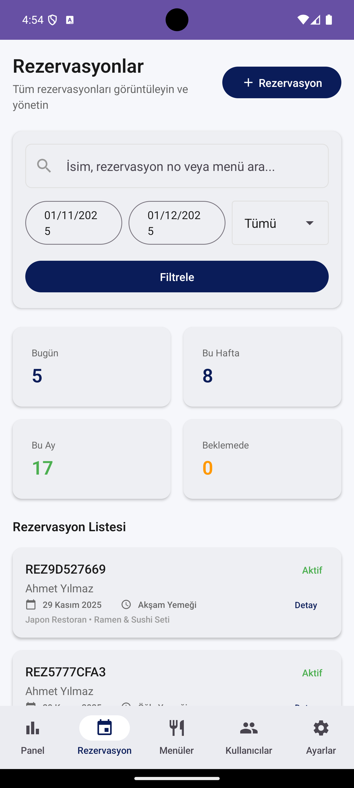
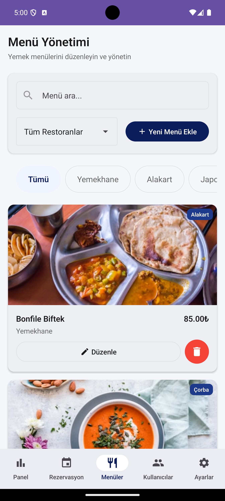
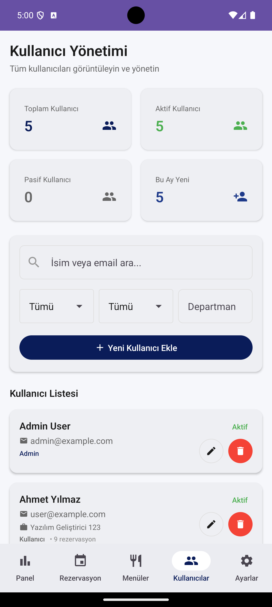
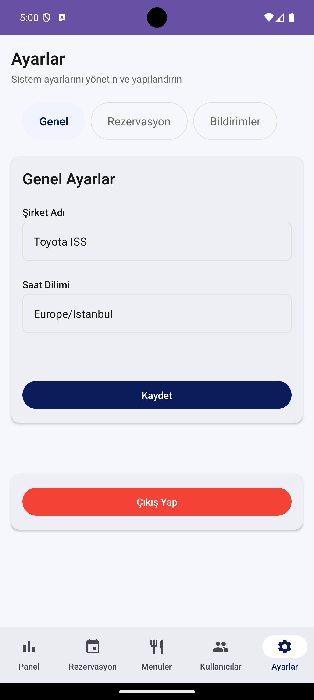

# Reservation App

A full-stack reservation management system with cross-platform mobile support, featuring a .NET 8 backend, React web frontend, iOS, and Android applications.

## Project Structure

```
reservation-app/
├── backend/          # .NET 8 Backend API
├── frontend/         # React Web Application
├── ios/              # iOS SwiftUI Application
└── android/          # Android Kotlin Application
```

## Screenshots

### Frontend (Web)
<div align="center">
  
  
  
  
  
  
  
  
  
  
  
  
</div>

### iOS
<div align="center">
  
  
  
  
  
  
  
  
  
</div>

### Android
<div align="center">
  
  
  
  
  
  
  
  
  
</div>

---

## Backend

### Tech Stack
- **Framework**: .NET 8, ASP.NET Core Web API
- **Database**: PostgreSQL with Entity Framework Core 8.0
- **Authentication**: JWT Bearer Tokens
- **Validation**: FluentValidation
- **Logging**: Serilog (Console, File, Seq)
- **Documentation**: Swagger/OpenAPI
- **Mapping**: AutoMapper
- **Password Hashing**: BCrypt.Net

### Architecture & Patterns
- **Clean Architecture** with clear separation of concerns:
  - **API Layer**: Controllers, middleware, dependency injection, Swagger configuration
  - **Application Layer**: Business logic, DTOs, services, validation, interfaces
  - **Domain Layer**: Entities, enums, domain exceptions (no external dependencies)
  - **Infrastructure Layer**: Data access, EF Core, repositories, database configuration
- **Repository Pattern** for data access abstraction
- **Dependency Injection** via interfaces only
- **Middleware-based** exception handling with centralized error responses
- **RESTful API** design with proper HTTP status codes

### Security
- **JWT Authentication** with token validation (issuer, audience, lifetime, signing key)
- **BCrypt password hashing** for secure credential storage
- **Role-based authorization** (Admin, User) with policy-based access control
- **HTTPS enforcement** in production
- **CORS policy** configured for specific origins
- **Secrets management** via configuration files (never hardcoded)
- **Input validation** using FluentValidation to prevent injection attacks
- **Centralized exception handling** prevents information leakage

### Features
- User authentication (register, login, JWT tokens)
- Reservation management (create, view, update, cancel)
- Restaurant and menu management
- Meal time slot management
- Admin dashboard with statistics and reports
- User profile management
- Weekly reservation limits enforcement
- Email notifications (configurable)
- Timezone-aware date/time handling

### How to Run

1. **Prerequisites**:
   - .NET 8 SDK
   - PostgreSQL 12+ (must be installed and running)
   - EF Core tools: `dotnet tool install --global dotnet-ef`

2. **Restore Dependencies**:
   ```bash
   cd backend
   dotnet restore
   ```

3. **Configure Database Connection** (if needed):
   The connection string is pre-configured in `backend/ReservationApp.API/appsettings.Development.json` with default values:
   - Username: `postgres`
   - Password: `postgres`
   - Database: `reservationdb`
   - Host: `localhost`

   **Update the connection string if your PostgreSQL setup is different:**
   - **macOS/Homebrew PostgreSQL**: Uses your system username instead of `postgres`. Edit `appsettings.Development.json` and change the username (usually no password needed):
     ```json
     "DefaultConnection": "Host=localhost;Database=reservationdb;Username=your_username"
     ```
     Replace `your_username` with your macOS username (run `whoami` to find it).
   - **Linux/Standard PostgreSQL**: Usually works with the default `postgres/postgres` credentials - no changes needed
   - **Custom password**: Update the `Password` value in the connection string
   - **No password**: Remove the `Password` parameter entirely

   **Why credentials are needed**: PostgreSQL requires authentication for security. The default `postgres` user is created automatically when PostgreSQL is installed (on Linux/Windows). On macOS with Homebrew, it typically uses your system username.

4. **Create Database** (if it doesn't exist):

   **Option 1** - Use the setup script (recommended, auto-detects your PostgreSQL user):
   ```bash
   cd backend
   chmod +x setup-database.sh
   ./setup-database.sh
   ```

   **Note**: The script automatically detects your PostgreSQL user. On macOS/Homebrew, it will use your system username (e.g., `mkisacik`) instead of `postgres` if the `postgres` user doesn't exist.

   **Option 2** - Manual creation:
   ```bash
   # For standard PostgreSQL (Linux/Windows):
   psql -U postgres
   CREATE DATABASE reservationdb;
   \q

   # For macOS/Homebrew (use your username):
   psql -U $(whoami)
   CREATE DATABASE reservationdb;
   \q
   ```

5. **Run Migrations**:
   ```bash
   cd backend
   ```

   **Check if migrations already exist**:
   ```bash
   ls ReservationApp.Infrastructure/Migrations
   ```

   - **If migrations folder exists and contains `.cs` files**: Migrations are already in the repository, skip to applying them:
     ```bash
     dotnet ef database update -p ReservationApp.Infrastructure -s ReservationApp.API
     ```

   - **If migrations folder is empty or doesn't exist**: Create initial migration first:
     ```bash
     dotnet ef migrations add InitialCreate -p ReservationApp.Infrastructure -s ReservationApp.API
     dotnet ef database update -p ReservationApp.Infrastructure -s ReservationApp.API
     ```

   **Troubleshooting**: If you get "Host can't be null" error, go back to step 3 and verify your connection string is correctly configured in `appsettings.Development.json`.

6. **Run Application**:

   **Option 1** (Recommended - from backend directory):
   ```bash
   cd backend
   dotnet run --project ReservationApp.API/ReservationApp.API.csproj
   ```

   **Option 2** (from API project directory):
   ```bash
   cd backend/ReservationApp.API
   dotnet run
   ```

   **Option 3** (using the run script):
   ```bash
   cd backend
   chmod +x run-app.sh
   ./run-app.sh
   ```

7. **Access**:
   - Swagger UI: `https://localhost:7195/swagger`
   - API: `https://localhost:7195` or `http://localhost:5053`

### Troubleshooting

**"role 'postgres' does not exist" (macOS/Homebrew)**:
- This is common on macOS when PostgreSQL is installed via Homebrew. It uses your system username instead of `postgres`.
- **Solution**: Update `appsettings.Development.json` (located at `backend/ReservationApp.API/appsettings.Development.json`) to use your username (usually no password needed):
  ```json
  "DefaultConnection": "Host=localhost;Database=reservationdb;Username=your_username"
  ```
- Replace `your_username` with your macOS username (run `whoami` to find it).
- The setup script (`./setup-database.sh`) now auto-detects this, so you can use it instead of manual commands.

**"Host can't be null" error**:
- This means your connection string is not configured or invalid. Check `appsettings.Development.json` and ensure the connection string is correct.
- The default connection string uses `postgres/postgres` - if your PostgreSQL setup is different, update it in step 3.
- Verify PostgreSQL is running: `pg_isready` or `psql -U postgres -c "SELECT 1"`
- Test your connection: `psql -U postgres -h localhost -c "SELECT 1"` (replace `postgres` with your username if different)

**"The name 'InitialCreate' is used by an existing migration"**:
- Migrations already exist in the repository. Skip the `migrations add` command and only run `database update`.

**"Application failed to start" during migrations**:
- Verify the connection string in `appsettings.Development.json` matches your PostgreSQL setup (default is `postgres/postgres`).
- Verify the database exists: `psql -U postgres -l | grep reservationdb`
- If the database doesn't exist, create it first (step 4).

**Port already in use**:
- The application is already running. Stop it first or change the port in `ReservationApp.API/Properties/launchSettings.json`.

### Database Seeder

The application includes an automatic database seeder that runs **only in Development mode** on every startup. The seeder populates the database with initial data if it doesn't already exist, making it safe to run multiple times.

#### Example Users

The seeder creates two default users for testing:

| Email | Password | Role | Name | Description |
|-------|----------|------|------|-------------|
| `admin@example.com` | `admin123` | Admin | Admin User | Administrator account with full access to all features |
| `user@example.com` | `user123` | User | Ahmet Yılmaz | Regular user account (Job Title: Yazılım Geliştirici) |

#### Seeded Data

The seeder automatically creates:

- **Meal Time Slots**:
  - Breakfast: 07:00 - 10:00
  - Lunch: 12:00 - 14:00
  - Dinner: 18:00 - 21:00

- **Restaurants**:
  - Yemekhane (Ana yemekhane restoranı)
  - Japon Restoran (Özel Japon mutfağı restoranı)

- **Menu Categories**:
  - Ana Yemek
  - Çorba
  - Alakart
  - Vejetaryen & Özel
  - Mesai Aperatif

- **Meals**: Various meals across different categories for both restaurants, including:
  - Turkish dishes (Köfte, Şinitzel, Karnıyarık, etc.)
  - Soups (Mantar, Mercimek, Domates)
  - Special items (Bonfile, Levrek, Risotto, etc.)
  - Japanese dishes (Sushi Seti, Ramen)

- **Menus**: Daily menus for the next 30 days for both restaurants (Standard and Special menu types)

- **System Settings**: Default configuration for:
  - General settings (CompanyName: "Toyota ISS", Timezone: "Europe/Istanbul")
  - Reservation settings (MaxWeeklyReservations: 5, CancellationNoticeHours: 24, etc.)
  - Notification settings (EmailEnabled: true, DailyReminderEnabled: true, etc.)

#### How It Works

The seeder checks for existing data before inserting, so it's idempotent:
- Users are only created if they don't exist (checked by email)
- Other entities are only created if the table is empty or missing specific items
- Existing data is never overwritten

To disable seeding, run the application in **Production** mode (the seeder only runs when `Environment.IsDevelopment()` is `true`).

---

## Frontend

### Tech Stack
- **Framework**: React 19 with Vite
- **UI Library**: Material-UI (MUI) v5
- **Routing**: React Router v6
- **State Management**: React Context API, TanStack Query (React Query)
- **HTTP Client**: Axios
- **Charts**: Recharts
- **Date Handling**: Day.js
- **Styling**: Emotion (CSS-in-JS)

### Architecture & Patterns
- **Component-based architecture** with reusable UI components
- **Context API** for global state (authentication)
- **React Query** for server state management, caching, and synchronization
- **Custom hooks** for reusable logic
- **API abstraction layer** with centralized axios client
- **Route protection** with authentication guards
- **Modular structure** separating pages, components, API, and utilities

### Security
- **JWT token storage** in localStorage (with automatic cleanup on 401)
- **Axios interceptors** for automatic token injection and error handling
- **Protected routes** requiring authentication
- **Automatic logout** on token expiration or invalid credentials
- **Secure API communication** via HTTPS in production
- **Input validation** on forms

### Features
- User authentication (login, register, logout)
- Reservation management (view, create, edit, cancel)
- Restaurant and menu browsing
- Personal dashboard with statistics
- Profile management
- Admin panel (dashboard, user management, menu management, reservations)
- Responsive design for desktop and mobile
- Real-time data updates with React Query

### How to Run

1. **Prerequisites**:
   - Node.js 18+
   - npm or yarn

2. **Install Dependencies**:
   ```bash
   cd frontend
   npm install
   ```

3. **Configure API URL** (optional):
   Create `.env` file:
   ```
   VITE_API_BASE_URL=http://localhost:5053/api
   ```

4. **Run Development Server**:
   ```bash
   npm run dev
   ```

5. **Access**:
   - Application: `http://localhost:5173`

---

## iOS

### Tech Stack
- **Language**: Swift
- **Framework**: SwiftUI
- **Architecture**: MVVM (Model-View-ViewModel)
- **Networking**: URLSession with async/await
- **Reactive Programming**: Combine framework
- **Storage**: Keychain Services for secure token storage
- **Image Caching**: Custom image cache service

### Architecture & Patterns
- **MVVM architecture** with ViewModels managing business logic
- **Repository pattern** for data access abstraction (AuthRepository, ReservationRepository, etc.)
- **Protocol-oriented design** with repository protocols
- **Dependency injection** via shared singletons (APIClient, KeychainManager)
- **Separation of concerns**: Core (network, storage, services), Data (repositories), Domain (models, enums), Presentation (views, view models)
- **Theme management** with centralized colors, typography, and spacing

### Security
- **Keychain Services** for secure JWT token storage (encrypted, hardware-backed)
- **HTTPS-only** API communication
- **Token-based authentication** with automatic token injection
- **Automatic logout** on 401 unauthorized responses
- **Secure credential handling** (no plaintext storage)

### Features
- User authentication (login, logout)
- Reservation management (create, view, cancel)
- Restaurant and menu browsing
- Personal dashboard with statistics
- Profile management
- Admin features (dashboard, user management, menu management, reservations)
- Onboarding flow
- Image caching for performance
- Dark mode support (via theme system)

### How to Run

1. **Prerequisites**:
   - Xcode 14+ (with iOS 15+ SDK)
   - macOS
   - CocoaPods (if using pods)

2. **Open Project**:
   ```bash
   cd ios
   open ReservationApp/ReservationApp.xcodeproj
   ```

3. **Configure API URL** (if needed):
   Update `AppConstants.API.baseURL` in `Core/Constants/AppConstants.swift`

4. **Run**:
   - Select a simulator or connected device
   - Press `Cmd + R` or click Run

---

## Android

### Tech Stack
- **Language**: Kotlin
- **UI Framework**: Jetpack Compose
- **Architecture**: MVVM (Model-View-ViewModel)
- **Dependency Injection**: Hilt (Dagger)
- **Networking**: Retrofit 2 + OkHttp + Gson
- **Storage**: DataStore Preferences + Encrypted Preferences
- **Image Loading**: Coil
- **Logging**: Timber
- **Coroutines**: Kotlin Coroutines for async operations

### Architecture & Patterns
- **Modular architecture** with feature modules:
  - **Core modules**: common, network, storage, ui
  - **Domain layer**: business logic, use cases, models
  - **Data layer**: repositories, data sources
  - **Feature modules**: auth, home, profile, reservations, make-reservation
- **MVVM pattern** with ViewModels and Compose UI
- **Repository pattern** for data access
- **Dependency injection** with Hilt
- **Clean Architecture** principles with clear layer separation

### Security
- **Encrypted Preferences** (AndroidX Security Crypto) for secure token storage
- **HTTPS-only** API communication
- **JWT token-based authentication** with automatic token injection
- **Secure credential storage** using Android Keystore-backed encryption
- **Automatic token refresh** and logout on authentication failures

### Features
- User authentication (login, logout)
- Reservation management (create, view, cancel)
- Restaurant and menu browsing
- Personal dashboard with statistics
- Profile management
- Admin features (dashboard, user management, menu management, reservations)
- Material Design 3 UI
- Image loading and caching
- Offline support capabilities

### How to Run

1. **Prerequisites**:
   - Android Studio Hedgehog (2023.1.1) or later
   - JDK 17+
   - Android SDK (API 24+)

2. **Open Project**:
   ```bash
   cd android
   # Open in Android Studio
   ```

3. **Configure API URL** (if needed):
   Update base URL in network module configuration

4. **Sync & Build**:
   - Android Studio will sync Gradle automatically
   - Build: `Build > Make Project` or `Ctrl+F9` (Windows/Linux) / `Cmd+F9` (Mac)

5. **Run**:
   - Select an emulator or connected device
   - Click Run or press `Shift+F10` (Windows/Linux) / `Ctrl+R` (Mac)

---

## Testing

### Backend Tests
```bash
cd backend
dotnet test
```

### Frontend Tests
```bash
cd frontend
npm test
```

